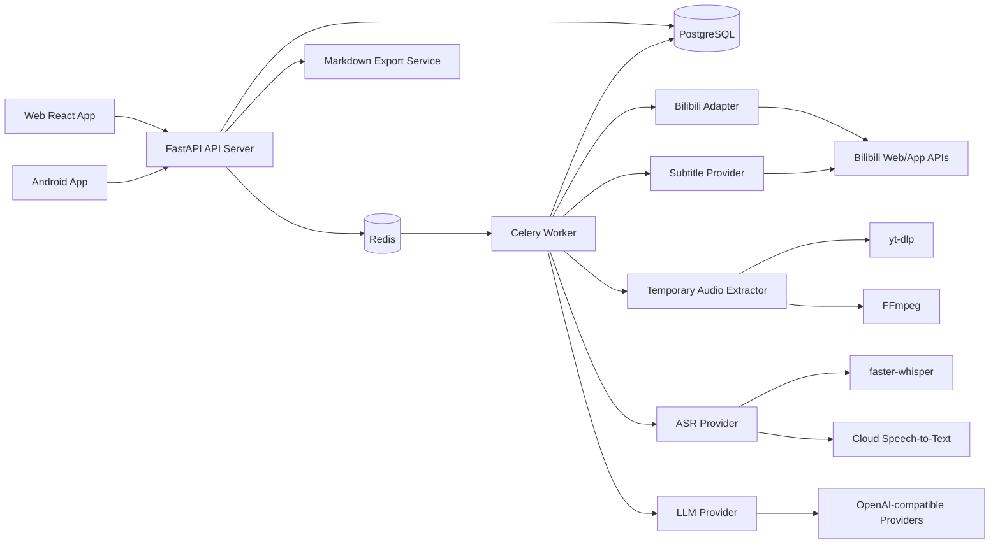
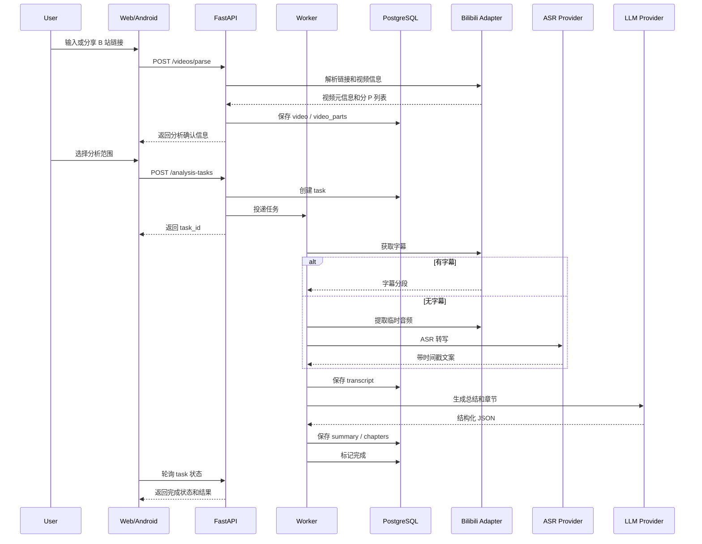
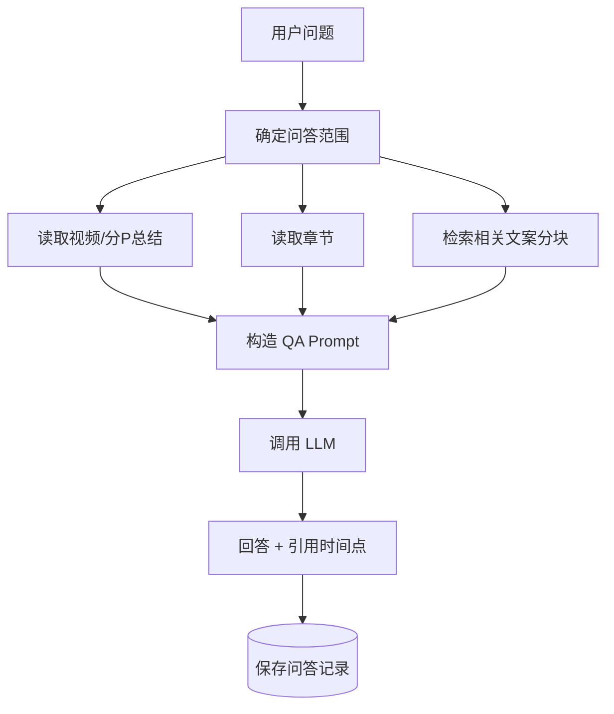

# BiliHelper 技术选型与架构设计文档

生成日期：2026-04-29

## 1. 文档目标

本文档基于 `BiliHelper_Product.md`，定义 BiliHelper 的技术选型、系统架构、核心模块、数据模型、接口边界、任务流程、部署方式与主要风险。

本文档聚焦工程实现方案，不重复展开产品功能细节。后续进入开发阶段时，可继续拆分为：

- 后端接口文档
- 数据库迁移设计
- Web 页面交互设计
- Android 页面与 Intent 设计
- LLM Prompt 与结构化输出规范

## 2. 设计原则

### 2.1 客户端轻量，后端统一处理

Web 端和 Android 端只负责：

- 登录与配置
- 链接输入或分享接收
- 分析范围选择
- 任务状态展示
- 历史记录展示
- 文案、总结、章节、问答和导出入口

所有重计算和不稳定外部依赖都放在后端：

- B 站链接解析
- 分 P 信息获取
- 字幕获取
- 临时音频提取
- ASR
- LLM 总结
- 问答上下文检索
- Markdown 导出

这样可以避免 Android 和 Web 各自实现一套解析逻辑，也便于统一处理 Cookie、风控、重试、缓存和日志。

### 2.2 不保存视频文件

产品已移除视频下载功能，因此系统不保存完整视频文件。

允许存在的临时文件：

- 无字幕时用于 ASR 的临时音频文件
- ASR 分片音频
- 临时 Markdown 导出文件

临时音频应在任务完成或失败后清理。长期保存的数据应以文本和结构化结果为主：

- 视频元信息
- 分 P 信息
- 字幕或 ASR 文案
- 分段时间戳
- 总结
- 章节
- 问答记录
- 导出配置或导出结果

### 2.3 B 站能力必须适配层隔离

B 站接口、字幕入口、Cookie 机制和风控策略都可能变化。因此后端不应让业务代码直接依赖具体接口细节。

推荐抽象：

- `BilibiliResolver`：负责链接归一化、BV/AV 提取、短链展开。
- `BilibiliMetadataProvider`：负责获取视频和分 P 元信息。
- `BilibiliSubtitleProvider`：负责获取已有字幕。
- `AudioExtractor`：仅在无字幕时提取临时音频。

任何第三方库或直接 HTTP 请求都只能出现在这些适配层内部。

### 2.4 LLM 与 ASR 可替换

不同用户的大模型供应商和预算不同，因此系统应支持 Provider 抽象：

- LLM 总结 Provider
- LLM 问答 Provider
- Embedding Provider，可选
- ASR Provider

第一版可以优先支持 OpenAI 兼容接口，但接口设计上不应绑定单一厂商。

### 2.5 个人使用优先

项目主要面向个人使用，不做大规模商用架构。

优先级排序：

1. 可本地部署
2. 功能链路完整
3. 数据安全可控
4. 失败可重试
5. 后续可扩展

不优先追求：

- 高并发
- 多租户复杂隔离
- 分布式文件系统
- 大规模任务调度
- 复杂权限系统

## 3. 总体技术选型

| 模块 | 推荐选型 | 说明 |
| --- | --- | --- |
| 后端 API | Python 3.12+ + FastAPI | Python 生态适合 B 站解析、字幕、ASR、LLM 调用；FastAPI 适合构建类型明确的 REST API。 |
| 后端数据校验 | Pydantic v2 | 与 FastAPI 集成自然，适合定义请求、响应和 LLM 结构化结果。 |
| ORM | SQLAlchemy 2.x | 成熟、可控，适合后续从 SQLite 迁移到 PostgreSQL。 |
| 数据库迁移 | Alembic | 与 SQLAlchemy 配套。 |
| 主数据库 | PostgreSQL | 历史记录、分 P、问答、任务状态等结构化数据较多，PostgreSQL 更稳。 |
| 本地开发数据库 | SQLite，可选 | 只建议用于最小开发环境；正式个人部署仍建议 PostgreSQL。 |
| 向量检索 | pgvector，可选增强 | 用于长视频问答的语义检索；MVP 可先用全文检索。 |
| 任务队列 | Redis + Celery | 分析任务耗时长，需要异步执行、重试和状态记录。 |
| Web 前端 | React + TypeScript + Vite | 工具型单页应用，后端已承担 API 和业务逻辑，不需要 Next.js 的服务端能力。 |
| Web 状态请求 | TanStack Query | 适合任务轮询、缓存历史列表、错误状态处理。 |
| Web 路由 | React Router | 页面结构简单清晰。 |
| Android | Kotlin + Jetpack Compose | Android-only 项目，Compose 适合快速实现原生 UI。 |
| Android 网络 | Retrofit + OkHttp | Android/JVM 常用 HTTP 客户端组合。 |
| Android 本地安全存储 | EncryptedSharedPreferences 或 Jetpack Security | 保存登录 token，不保存用户大模型 API Key。 |
| B 站元信息 | bilibili-api-python + 直接 HTTP 适配 fallback | 通过适配层隔离；注意 GPLv3 许可证和接口变动风险。 |
| 字幕获取 | B 站字幕接口适配层 + bilibili-api-python/bccdl 参考 | 优先获取已有字幕；失败后进入 ASR。 |
| 临时音频提取 | yt-dlp + FFmpeg | 仅用于无字幕场景；不保存完整视频。 |
| 本地 ASR | faster-whisper，可选 | 有本地 GPU 或可接受 CPU 耗时时使用。 |
| 云端 ASR | OpenAI Speech-to-Text 或兼容服务，可选 | 质量稳定，但需要处理文件大小限制、切片和成本。 |
| LLM 调用 | OpenAI-compatible adapter | 支持 OpenAI、DeepSeek、Qwen、Ollama 等兼容或半兼容接口。 |
| Markdown 导出 | 后端模板渲染 | 使用服务端统一生成，Web 下载，Android 分享。 |
| 部署 | Docker Compose | 适合个人部署，包含 API、Worker、Redis、PostgreSQL、Web。 |

## 4. 为什么选择这套方案

### 4.1 后端选择 Python + FastAPI

BiliHelper 的核心链路包含：

- 调用 B 站相关接口
- 处理字幕 JSON
- 调用 FFmpeg
- 调用 ASR 模型
- 调用 LLM
- 生成 Markdown
- 管理异步任务

这些工作在 Python 生态中更直接。FastAPI 基于 Python 类型提示，自动生成 OpenAPI 文档，适合 Web 和 Android 共用同一套后端接口。

Node.js 也能实现，但在 ASR、本地模型、音频处理和 Python 生态库复用上优势较弱。

### 4.2 Web 选择 React + Vite，而不是 Next.js

本项目 Web 端是登录后的工具型应用，不需要复杂 SEO 和服务端渲染。

React + Vite 的优势：

- 启动快
- 工程简单
- 适合 SPA
- 容易和 FastAPI 分离部署

Next.js 的服务端路由、SSR、Server Actions 对本项目不是必要能力，反而会增加部署和认证边界复杂度。

### 4.3 Android 选择 Kotlin + Jetpack Compose

Android 端需要稳定支持：

- 从 B 站 App 接收分享
- 登录状态
- 历史记录查看
- 任务状态轮询
- 文案、章节和问答展示
- Markdown 分享

这些能力使用原生 Android 更稳。Flutter 或 React Native 也可以实现，但项目只要求 Android，不需要跨平台框架带来的额外抽象。

### 4.4 数据库选择 PostgreSQL

虽然个人项目可以从 SQLite 起步，但 BiliHelper 很快会需要：

- 多表关联
- 任务状态查询
- 历史记录搜索
- 分 P 结果聚合
- 问答记录保存
- 文案 chunk 检索
- 可选向量检索

PostgreSQL 更适合作为主数据库。SQLite 可作为开发模式，但不建议作为长期部署默认方案。

### 4.5 任务队列选择 Celery + Redis

视频分析任务可能持续数十秒到数十分钟，不能放在 HTTP 请求中同步执行。

Celery 适合处理：

- 长任务
- 重试
- 并发 Worker
- 任务路由
- 失败记录
- 后续定时清理任务

Redis 作为 broker 和轻量缓存即可满足个人部署。

## 5. 总体架构



### 5.1 核心服务边界

| 服务 | 职责 |
| --- | --- |
| Web App | 用户入口、任务创建、结果展示、历史、问答、导出下载。 |
| Android App | 分享入口、任务创建、移动端展示、Markdown 分享。 |
| API Server | 认证、配置管理、任务创建、查询、问答请求、导出请求。 |
| Worker | 执行视频解析、字幕获取、ASR、总结、章节、全视频总结。 |
| PostgreSQL | 保存用户、配置、视频、分 P、文案、总结、章节、问答和任务状态。 |
| Redis | Celery broker、任务中间状态、短期缓存。 |
| Bilibili Adapter | 隔离 B 站链接解析、元信息、字幕和临时音频入口。 |
| ASR Provider | 云端或本地语音识别。 |
| LLM Provider | 总结、章节、问答、可选 embedding。 |
| Export Service | 按模板生成 Markdown。 |

## 6. 推荐仓库结构

```text
BiliHelper/
  docs/
    BiliHelper_Product.md
    BiliHelper_Technical_Design.md
  backend/
    app/
      main.py
      api/
      core/
      models/
      schemas/
      services/
      integrations/
      workers/
      prompts/
      exporters/
      repositories/
    migrations/
    tests/
    pyproject.toml
  web/
    src/
      api/
      components/
      pages/
      routes/
      stores/
      types/
    package.json
    vite.config.ts
  android/
    app/
    build.gradle.kts
    settings.gradle.kts
  docker/
    nginx/
  docker-compose.yml
  .env.example
  README.md
```

当前目录下已经存在 `BiliHelper_Product.md`，后续可以把两份文档迁移到 `docs/` 目录。

## 7. 后端模块设计

### 7.1 API 层

推荐按业务域拆分路由：

```text
api/
  auth.py
  llm_configs.py
  bilibili.py
  analysis_tasks.py
  videos.py
  qa.py
  exports.py
```

职责：

- 参数校验
- 当前用户识别
- 权限检查
- 调用 service
- 返回标准响应

API 层不直接操作 B 站接口、不调用 ASR、不拼 Prompt。

### 7.2 Service 层

```text
services/
  auth_service.py
  credential_service.py
  video_service.py
  analysis_service.py
  transcript_service.py
  summary_service.py
  qa_service.py
  export_service.py
```

职责：

- 编排业务逻辑
- 管理事务边界
- 创建任务
- 读取和更新数据库
- 做权限判断

### 7.3 Worker 层

```text
workers/
  celery_app.py
  tasks/
    parse_video.py
    analyze_part.py
    generate_video_summary.py
    cleanup_temp_files.py
```

职责：

- 执行长耗时任务
- 更新任务状态
- 记录失败原因
- 控制重试
- 清理临时文件

### 7.4 Integration 层

```text
integrations/
  bilibili/
    resolver.py
    metadata.py
    subtitles.py
    audio.py
  asr/
    base.py
    openai_asr.py
    faster_whisper_asr.py
  llm/
    base.py
    openai_compatible.py
    ollama.py
  embedding/
    base.py
    openai_compatible.py
```

职责：

- 对接外部服务或第三方库
- 隐藏供应商差异
- 输出统一内部模型

## 8. 核心处理流程

### 8.1 普通视频分析流程



### 8.2 分 P 视频分析流程

分 P 视频按 `video` 和 `video_parts` 两层处理。

流程：

1. 解析链接，获取完整分 P 列表。
2. 用户选择全部、当前 P 或部分 P。
3. 创建一个 `analysis_task` 作为总任务。
4. 为每个被选择的 P 创建一个 `part_analysis_task`。
5. Worker 并发或串行处理每个 P。
6. 每个 P 独立生成文案、总结和章节。
7. 当所有选中 P 完成后，生成全视频总结。
8. 总任务完成。

分 P 处理规则：

- 单个 P 失败不应导致已完成 P 丢失。
- 总任务状态可以是 `partial_failed`。
- 用户可以只重试失败的 P。
- 全视频总结只基于已完成的 P 生成。
- 重新分析时应保留旧版本直到新版本成功，避免结果被失败任务覆盖。

### 8.3 问答流程



问答上下文来源：

- 当前视频总览总结
- 当前 P 或选中 P 的总结
- 章节信息
- 相关 transcript chunks

第一版可以使用 PostgreSQL 全文检索或简单关键词检索。后续增强时接入 embedding 和 pgvector。

## 9. 数据模型设计

### 9.1 用户与配置

#### users

| 字段 | 说明 |
| --- | --- |
| id | 用户 ID |
| username | 用户名 |
| email | 邮箱，可选 |
| password_hash | 密码哈希 |
| status | active / disabled |
| created_at | 创建时间 |
| updated_at | 更新时间 |

#### api_credentials

| 字段 | 说明 |
| --- | --- |
| id | 配置 ID |
| user_id | 所属用户 |
| provider | openai / deepseek / qwen / ollama / custom |
| api_base_url | 可选 Base URL |
| api_key_encrypted | 加密后的 API Key |
| default_model | 默认文本模型 |
| default_asr_model | 默认 ASR 模型，可选 |
| default_embedding_model | 默认 embedding 模型，可选 |
| is_default | 是否默认 |
| created_at | 创建时间 |
| updated_at | 更新时间 |

注意：

- API Key 只能后端解密使用。
- API 不返回完整 API Key。
- 前端只显示脱敏值，例如 `sk-****abcd`。

#### bilibili_credentials，可选

| 字段 | 说明 |
| --- | --- |
| id | 配置 ID |
| user_id | 所属用户 |
| sessdata_encrypted | 加密后的 SESSDATA |
| bili_jct_encrypted | 加密后的 bili_jct |
| buvid3_encrypted | 加密后的 buvid3 |
| enabled | 是否启用 |
| updated_at | 更新时间 |

该表用于需要登录态才能访问字幕或音频的场景。第一版可以不开放 UI，只通过环境变量或后台配置支持。

### 9.2 视频与分 P

#### videos

| 字段 | 说明 |
| --- | --- |
| id | 视频 ID |
| bvid | BV 号 |
| aid | AV 号，可选 |
| title | 视频标题 |
| owner_name | UP 主名称 |
| owner_mid | UP 主 ID，可选 |
| cover_url | 封面 URL |
| source_url | 原始链接 |
| duration | 总时长，秒 |
| description | 视频简介 |
| published_at | 发布时间 |
| part_count | 分 P 数量 |
| created_at | 创建时间 |
| updated_at | 更新时间 |

#### video_parts

| 字段 | 说明 |
| --- | --- |
| id | 分 P ID |
| video_id | 所属视频 |
| page_no | P 序号，从 1 开始 |
| cid | B 站 cid |
| title | 分 P 标题 |
| duration | 分 P 时长，秒 |
| source_url | 对应 P 的链接 |
| created_at | 创建时间 |
| updated_at | 更新时间 |

唯一约束：

- `(video_id, page_no)`
- `(video_id, cid)`

### 9.3 分析任务

#### analysis_tasks

| 字段 | 说明 |
| --- | --- |
| id | 总任务 ID |
| user_id | 创建用户 |
| video_id | 目标视频 |
| status | waiting / running / completed / failed / partial_failed |
| selected_part_ids | 选择分析的分 P ID 列表 |
| force_reanalyze | 是否重新分析 |
| progress | 0-100 |
| error_message | 错误信息 |
| started_at | 开始时间 |
| finished_at | 结束时间 |
| created_at | 创建时间 |

#### part_analysis_tasks

| 字段 | 说明 |
| --- | --- |
| id | 子任务 ID |
| analysis_task_id | 所属总任务 |
| video_part_id | 目标分 P |
| status | waiting / fetching_subtitle / asr / summarizing / completed / failed |
| transcript_source | bili_subtitle / asr / manual |
| progress | 0-100 |
| error_message | 错误信息 |
| retry_count | 重试次数 |
| started_at | 开始时间 |
| finished_at | 结束时间 |

### 9.4 文案、章节和总结

#### transcript_segments

| 字段 | 说明 |
| --- | --- |
| id | 段落 ID |
| video_part_id | 所属分 P |
| source | bili_subtitle / asr |
| start_time | 开始时间，秒 |
| end_time | 结束时间，秒 |
| text | 文案内容 |
| sequence_no | 顺序 |
| confidence | ASR 置信度，可选 |

#### transcript_chunks

| 字段 | 说明 |
| --- | --- |
| id | Chunk ID |
| video_part_id | 所属分 P |
| start_time | 覆盖开始时间 |
| end_time | 覆盖结束时间 |
| text | 聚合后的 chunk 文本 |
| token_count | 估算 token 数 |
| embedding | 可选向量 |
| metadata | JSON 元数据 |

`transcript_chunks` 用于问答检索，不直接替代 `transcript_segments`。

#### part_summaries

| 字段 | 说明 |
| --- | --- |
| id | 总结 ID |
| video_part_id | 所属分 P |
| summary | 短摘要 |
| detailed_summary | 详细总结 |
| key_points | JSON 数组 |
| model_provider | 使用的模型供应商 |
| model_name | 使用的模型名称 |
| prompt_version | Prompt 版本 |
| created_at | 创建时间 |

#### chapters

| 字段 | 说明 |
| --- | --- |
| id | 章节 ID |
| video_part_id | 所属分 P |
| start_time | 开始时间 |
| end_time | 结束时间，可选 |
| title | 章节标题 |
| description | 章节描述 |
| keywords | JSON 数组 |
| sequence_no | 顺序 |

#### video_summaries

| 字段 | 说明 |
| --- | --- |
| id | 全视频总结 ID |
| video_id | 所属视频 |
| summary | 总览摘要 |
| detailed_summary | 详细总览 |
| part_overview | 每 P 摘要 JSON |
| key_points | 全局重点 JSON |
| model_provider | 使用的模型供应商 |
| model_name | 使用的模型名称 |
| prompt_version | Prompt 版本 |
| created_at | 创建时间 |

### 9.5 问答与导出

#### qa_sessions

| 字段 | 说明 |
| --- | --- |
| id | 会话 ID |
| user_id | 所属用户 |
| video_id | 所属视频 |
| title | 会话标题，可选 |
| scope | all / current_part / selected_parts |
| selected_part_ids | 选中的分 P |
| created_at | 创建时间 |
| updated_at | 更新时间 |

#### qa_messages

| 字段 | 说明 |
| --- | --- |
| id | 消息 ID |
| session_id | 所属会话 |
| role | user / assistant |
| content | 消息内容 |
| citations | 引用片段 JSON |
| model_provider | 使用的模型供应商 |
| model_name | 使用的模型名称 |
| created_at | 创建时间 |

#### export_records，可选

| 字段 | 说明 |
| --- | --- |
| id | 导出记录 ID |
| user_id | 用户 |
| video_id | 视频 |
| scope | video / part |
| video_part_id | 单 P 导出时使用 |
| options | 导出选项 JSON |
| file_name | 文件名 |
| created_at | 创建时间 |

第一版可以不长期保存导出文件，只记录导出行为，Markdown 内容按请求实时生成。

## 10. 状态机设计

### 10.1 总任务状态

```text
waiting
  -> running
  -> completed
  -> failed
  -> partial_failed
```

含义：

- `waiting`：任务已创建，尚未被 Worker 执行。
- `running`：至少一个分 P 子任务正在处理。
- `completed`：所有选中分 P 和必要的全视频总结均完成。
- `failed`：任务未产生任何可用结果。
- `partial_failed`：部分分 P 成功，部分失败。

### 10.2 分 P 子任务状态

```text
waiting
  -> resolving
  -> fetching_subtitle
  -> extracting_audio
  -> transcribing
  -> summarizing
  -> completed
  -> failed
```

前端展示时可以映射为用户友好的文案：

- 正在解析视频
- 正在获取字幕
- 正在进行语音识别
- 正在生成总结
- 已完成
- 已失败

## 11. B 站解析与字幕策略

### 11.1 链接归一化

需要支持：

- `https://www.bilibili.com/video/BV...`
- `https://b23.tv/...`
- 移动端分享文本中的链接
- 带 `p=` 参数的分 P 链接
- AV 链接

处理步骤：

1. 从输入文本提取 URL。
2. 如果是短链，后端请求展开。
3. 提取 bvid、aid、p 参数。
4. 统一存储 canonical URL。
5. 解析完整分 P 列表。

### 11.2 元信息获取

优先通过适配层调用：

- `bilibili-api-python`
- 直接 HTTP fallback

输出统一结构：

```json
{
  "bvid": "BV...",
  "aid": 123,
  "title": "...",
  "owner_name": "...",
  "cover_url": "...",
  "duration": 3600,
  "parts": [
    {
      "page_no": 1,
      "cid": 456,
      "title": "P1 ...",
      "duration": 600
    }
  ]
}
```

### 11.3 字幕优先

每个分 P 独立尝试获取字幕。

字幕标准化为：

```json
[
  {
    "start_time": 0.0,
    "end_time": 4.2,
    "text": "..."
  }
]
```

字幕来源优先级：

1. UP 主上传字幕
2. B 站自动字幕
3. B 站 AI 字幕
4. ASR

如果字幕内容过短、时间戳异常或语言不匹配，应标记为不可用并进入 ASR。

### 11.4 ASR 兜底

当无可用字幕时：

1. 提取该分 P 的临时音频。
2. 将音频转为 ASR 友好格式，例如 mono wav/mp3。
3. 如果云端 ASR 有大小限制，按时间或文件大小切片。
4. 调用 ASR Provider。
5. 合并分片结果并修正时间偏移。
6. 保存 transcript segments。
7. 删除临时音频。

注意：

- 临时音频不是产品下载能力。
- 不暴露音频下载链接。
- 失败日志中不记录敏感 Cookie。

## 12. LLM 总结与章节生成

### 12.1 Prompt 版本化

所有总结和章节生成 Prompt 都应版本化。

原因：

- 后续 Prompt 调整会影响输出格式。
- 历史结果需要知道由哪个 Prompt 生成。
- 便于回归测试。

建议字段：

```text
prompt_version = "summary_chapters_v1"
```

### 12.2 结构化输出

LLM 输出应尽量要求 JSON Schema。

推荐内部结构：

```json
{
  "summary": "短摘要",
  "detailed_summary": "详细总结",
  "key_points": [
    "要点 1",
    "要点 2"
  ],
  "chapters": [
    {
      "start_time": 0,
      "end_time": 120,
      "title": "章节标题",
      "description": "章节描述",
      "keywords": ["关键词"]
    }
  ]
}
```

后端必须做二次校验：

- JSON 可解析
- 必填字段存在
- 时间点在分 P 时长范围内
- 章节按时间递增
- 空章节时允许降级为仅总结

如果供应商不支持严格结构化输出，则采用：

1. 强制 JSON Prompt
2. Pydantic 校验
3. 一次自动修复重试
4. 仍失败则保存原始错误并标记任务失败

### 12.3 长文案处理

长视频可能超过模型上下文窗口。

处理策略：

1. 将 transcript 按时间顺序切 chunk。
2. 对每个 chunk 做局部摘要。
3. 合并局部摘要生成分 P 总结和章节。
4. 对分 P 总结再生成全视频总结。

不要直接把超长 transcript 全量塞给 LLM。

## 13. 问答设计

### 13.1 MVP 问答策略

第一版问答目标是“简单可用”，不追求复杂 RAG。

推荐上下文组装：

1. 始终包含视频总览总结，如存在。
2. 包含用户选择范围内的分 P 总结。
3. 包含相关章节标题和描述。
4. 检索若干 transcript chunks。
5. 要求回答包含引用时间点。

### 13.2 检索策略

第一阶段：

- 使用 PostgreSQL 全文检索或简单关键词匹配。
- 按分 P 范围过滤。
- 返回 top 5-10 个 chunks。

第二阶段：

- 接入 embedding。
- 使用 pgvector 做语义检索。
- 与全文检索做混合排序。

### 13.3 引用格式

问答回答应保存结构化引用：

```json
[
  {
    "part_id": 12,
    "page_no": 2,
    "start_time": 185.4,
    "end_time": 210.1,
    "text": "引用片段摘要"
  }
]
```

前端展示为：

- `P2 03:05`
- `P2 03:05-03:30`

点击引用后：

- Web 定位到对应文案位置，并提供打开 B 站对应时间点的链接。
- Android 定位到文案位置，并尝试打开 B 站 App 或浏览器。

## 14. Markdown 导出设计

### 14.1 导出方式

由后端按请求实时生成 Markdown。

优点：

- 不需要长期保存导出文件。
- 导出模板统一。
- Android 和 Web 共用同一能力。

### 14.2 导出接口

推荐：

```text
GET /api/exports/videos/{video_id}.md
GET /api/exports/parts/{part_id}.md
```

查询参数：

```text
include_transcript=true
include_chapters=true
include_qa=false
```

### 14.3 导出模板

全视频导出结构：

```md
# 视频标题

- UP 主：
- 链接：
- 分 P 数量：
- 分析时间：

## 全视频总结

...

## 分 P 目录

- P1 标题
- P2 标题

## P1 标题

### 摘要

...

### 章节

- 00:00 章节标题：章节描述

### 文案

...

## 问答记录

...
```

## 15. REST API 设计

### 15.1 认证

```text
POST /api/auth/register
POST /api/auth/login
POST /api/auth/refresh
POST /api/auth/logout
GET  /api/auth/me
```

建议：

- Web 使用 HttpOnly Cookie 保存 refresh token。
- Android 使用安全本地存储保存 refresh token。
- Access token 有效期短，refresh token 有效期较长。

### 15.2 大模型配置

```text
GET    /api/llm-configs
POST   /api/llm-configs
PATCH  /api/llm-configs/{id}
DELETE /api/llm-configs/{id}
POST   /api/llm-configs/{id}/test
POST   /api/llm-configs/{id}/set-default
```

### 15.3 视频解析与分析

```text
POST /api/videos/parse
POST /api/analysis-tasks
GET  /api/analysis-tasks/{id}
POST /api/analysis-tasks/{id}/retry
POST /api/parts/{part_id}/reanalyze
```

`POST /api/videos/parse` 输入：

```json
{
  "url": "https://www.bilibili.com/video/BV..."
}
```

返回：

```json
{
  "video": {},
  "parts": [],
  "already_analyzed": true
}
```

`POST /api/analysis-tasks` 输入：

```json
{
  "video_id": 1,
  "part_ids": [1, 2, 3],
  "force_reanalyze": false
}
```

### 15.4 历史记录

```text
GET    /api/videos/history
GET    /api/videos/{video_id}
GET    /api/videos/{video_id}/parts
GET    /api/parts/{part_id}/analysis
DELETE /api/videos/{video_id}/history
```

历史列表支持参数：

```text
q=
owner=
status=
sort=created_at_desc
page=
page_size=
```

### 15.5 问答

```text
GET  /api/videos/{video_id}/qa-sessions
POST /api/videos/{video_id}/qa-sessions
GET  /api/qa-sessions/{session_id}/messages
POST /api/qa-sessions/{session_id}/messages
```

提问输入：

```json
{
  "question": "这个视频主要讲了什么？",
  "scope": "selected_parts",
  "part_ids": [1, 2]
}
```

返回：

```json
{
  "answer": "...",
  "citations": []
}
```

## 16. Web 端设计

### 16.1 页面结构

```text
/login
/register
/settings/llm
/videos/new
/tasks/:taskId
/history
/videos/:videoId
/videos/:videoId/parts/:partId
/videos/:videoId/qa
```

### 16.2 主要组件

| 组件 | 职责 |
| --- | --- |
| LinkInput | 输入 B 站链接并提交解析。 |
| VideoPreview | 展示视频基础信息和分 P 列表。 |
| PartSelector | 选择分析全部、当前 P 或部分 P。 |
| TaskProgress | 展示任务状态和进度。 |
| HistoryList | 历史记录搜索和筛选。 |
| VideoDetail | 视频级总结、分 P 列表、导出入口。 |
| PartAnalysisView | 单 P 文案、总结、章节。 |
| ChapterList | 可点击章节时间点。 |
| TranscriptView | 带时间戳文案展示、定位、高亮。 |
| QAView | 基于视频上下文的问答。 |
| ExportMenu | Markdown 导出选项。 |

### 16.3 任务进度获取

MVP 使用轮询：

- 任务进行中每 2-5 秒请求一次。
- 任务完成或失败后停止。
- 浏览器切后台时降低频率。

后续可升级为 SSE：

- 服务端推送任务状态。
- 减少轮询请求。

### 16.4 时间点跳转

因为系统不保存视频文件，Web 端时间点交互采用两种方式：

1. 优先定位到本页面 transcript segment。
2. 提供打开 B 站原视频对应 P 和时间点的链接。

不建议第一版嵌入复杂播放器。B 站外链播放、登录态和移动端行为都可能不稳定。

## 17. Android 端设计

### 17.1 Android 核心能力

Android App 负责：

- 登录
- 手动输入链接
- 接收 B 站分享文本
- 创建分析任务
- 查看任务状态
- 查看历史记录
- 查看视频、分 P、文案、总结、章节
- 发起问答
- 分享或保存 Markdown 导出

### 17.2 分享接收

使用 Android `ACTION_SEND` 接收 `text/plain`。

Manifest 中注册接收 Activity：

```xml
<intent-filter>
    <action android:name="android.intent.action.SEND" />
    <category android:name="android.intent.category.DEFAULT" />
    <data android:mimeType="text/plain" />
</intent-filter>
```

处理逻辑：

1. 读取 `Intent.EXTRA_TEXT`。
2. 提取 B 站 URL。
3. 如果用户未登录，先进入登录页，登录后继续。
4. 如果已登录，进入视频解析确认页。

### 17.3 Android 页面结构

```text
LoginScreen
HomeScreen
SharedLinkConfirmScreen
VideoParseScreen
TaskProgressScreen
HistoryScreen
VideoDetailScreen
PartDetailScreen
QAScreen
SettingsScreen
```

### 17.4 本地存储

Android 本地只保存：

- access token
- refresh token
- 最近使用的服务端地址
- 少量 UI 偏好

不保存：

- 用户大模型 API Key
- B 站 Cookie
- 完整文案缓存，除非后续明确支持离线模式

## 18. 安全设计

### 18.1 密码安全

推荐使用 Argon2id 或 bcrypt 保存密码哈希。

要求：

- 不保存明文密码。
- 登录失败限流。
- 后端日志不记录密码。

### 18.2 API Key 安全

用户大模型 API Key 必须：

- 后端加密存储。
- 使用服务端主密钥解密。
- 不返回给前端和 Android。
- 日志中脱敏。
- 删除配置时同步删除加密值。

推荐：

- 使用 AES-GCM 或 Fernet。
- 主密钥通过环境变量注入。
- `.env.example` 只放变量名，不放真实密钥。

### 18.3 前端与移动端安全

原则：

- 浏览器和 Android 不直接调用用户的大模型供应商。
- 所有 LLM/ASR 请求由后端代理执行。
- token 过期后使用 refresh 流程。
- 退出登录后清除本地 token。

### 18.4 B 站 Cookie 安全

如果支持用户配置 B 站 Cookie：

- 与大模型 API Key 使用同等级加密。
- 只用于用户自己的分析任务。
- 不在日志、错误、前端响应中暴露。
- 提供删除入口。

## 19. 部署架构

### 19.1 Docker Compose 服务

推荐个人部署包含：

```text
web
api
worker
redis
postgres
nginx
```

可选：

```text
asr-worker
```

当本地部署 faster-whisper 且希望单独限制资源时，可以把 ASR Worker 拆成单独服务。

### 19.2 数据卷

```text
postgres_data
redis_data
app_temp
app_exports
```

说明：

- `postgres_data`：长期数据。
- `redis_data`：Redis 持久化，可选。
- `app_temp`：临时音频和任务临时文件，应定期清理。
- `app_exports`：如果选择保存导出文件，则使用该目录。

### 19.3 环境变量

`.env.example` 应包含：

```text
APP_ENV=development
APP_SECRET_KEY=
DATABASE_URL=
REDIS_URL=
API_BASE_URL=
WEB_BASE_URL=
CREDENTIAL_ENCRYPTION_KEY=
DEFAULT_LLM_PROVIDER=
TEMP_FILE_TTL_HOURS=24
MAX_VIDEO_DURATION_SECONDS=7200
MAX_PARTS_PER_TASK=20
```

## 20. 性能与资源控制

### 20.1 任务并发

个人部署建议默认：

- API worker：1-2 个进程
- Celery worker：1-2 并发
- ASR worker：1 并发

原因：

- ASR 和 LLM 都可能耗时或产生费用。
- B 站请求并发过高容易触发风控。
- 个人部署机器资源有限。

### 20.2 限额建议

MVP 默认限制：

- 单个视频总时长不超过 2 小时。
- 单次最多分析 20 个分 P。
- 单个分 P ASR 音频最长不超过 60 分钟。
- 问答单次检索 chunk 不超过 10 个。
- 单个用户同时运行任务不超过 2 个。

这些限制应通过配置项调整。

### 20.3 缓存策略

可缓存：

- 视频元信息
- 分 P 信息
- 已获取字幕
- 已生成总结
- transcript chunks

不建议缓存：

- 用户 API Key 明文
- B 站 Cookie 明文
- 临时音频

## 21. 错误处理与重试

### 21.1 错误分类

| 类型 | 示例 | 处理 |
| --- | --- | --- |
| 用户输入错误 | 链接无效 | 直接返回 400。 |
| B 站访问错误 | 视频不存在、不可访问 | 标记任务失败，展示原因。 |
| 字幕错误 | 字幕为空、格式异常 | 进入 ASR 兜底。 |
| ASR 错误 | 文件过大、模型失败 | 重试后失败，保留任务错误。 |
| LLM 错误 | API Key 无效、限流、JSON 不合法 | 重试或提示用户检查配置。 |
| 系统错误 | 数据库异常、Worker 崩溃 | 记录日志，任务可重试。 |

### 21.2 重试策略

建议：

- B 站元信息请求：最多 2 次，指数退避。
- 字幕请求：最多 2 次。
- ASR 请求：最多 1-2 次，避免费用不可控。
- LLM 请求：限流类错误可重试，认证错误不重试。
- Markdown 导出：不需要任务重试，失败直接返回错误。

## 22. 测试策略

### 22.1 后端测试

必须覆盖：

- B 站链接解析
- 分 P 参数解析
- 字幕 JSON 标准化
- transcript chunk 切分
- LLM JSON 校验
- Markdown 导出
- 任务状态流转
- 用户权限隔离

测试类型：

- unit test：纯逻辑。
- integration test：数据库、Redis、任务队列。
- external test：真实 B 站接口，默认跳过，只在手动环境执行。

### 22.2 Web 测试

建议覆盖：

- 登录流程
- 链接提交
- 分 P 选择
- 任务状态页
- 历史列表
- 章节点击定位
- Markdown 导出按钮
- 问答发送与展示

### 22.3 Android 测试

建议覆盖：

- 分享 Intent 解析
- 登录状态恢复
- 历史列表加载
- 任务状态展示
- Markdown 分享 Intent

## 23. 日志与可观测性

### 23.1 日志字段

后端日志建议包含：

- request_id
- user_id，必要时脱敏
- task_id
- video_id
- part_id
- provider
- status
- duration_ms
- error_code

不得包含：

- API Key
- B 站 Cookie
- 明文密码
- 大段完整文案，除非调试模式且本地环境

### 23.2 任务事件

可记录任务事件表或 JSON 日志：

```text
task_created
video_resolved
subtitle_fetched
asr_started
asr_completed
summary_started
summary_completed
task_completed
task_failed
```

这些事件有助于排查“卡在哪一步”。

## 24. 主要技术风险

### 24.1 B 站接口不稳定

风险：

- 接口参数变化
- 字幕入口变化
- 短链展开失败
- Cookie 失效
- 风控拦截

应对：

- 所有 B 站能力放入适配层。
- 提供清晰错误信息。
- 支持配置 Cookie。
- 保留 ASR 兜底。
- 不承诺 100% 视频可解析。

### 24.2 第三方库许可证

`bilibili-api-python` 使用 GPLv3。个人使用问题较小，但如果后续公开分发或商用，需要重新评估许可证兼容性。

应对：

- 把它放在 adapter 内部。
- 保持可替换。
- 必要时改为自研最小 HTTP adapter。

### 24.3 ASR 成本和耗时

风险：

- 长视频 ASR 成本高。
- 本地 ASR CPU 很慢。
- 云端 ASR 有文件大小限制。

应对：

- 字幕优先。
- 限制视频时长。
- 音频切片。
- 提供任务预估。
- 允许用户选择是否启用 ASR。

### 24.4 LLM 输出不稳定

风险：

- JSON 格式错误。
- 章节时间点不合理。
- 摘要过短或偏题。

应对：

- 使用结构化输出能力。
- Pydantic 校验。
- Prompt 版本化。
- 失败自动修复一次。
- 保存原始错误便于排查。

### 24.5 长视频问答上下文过大

风险：

- 直接塞全文会超出上下文。
- 回答引用不准确。

应对：

- transcript chunk 化。
- 检索相关片段。
- 回答必须带引用。
- 后续接入 pgvector。

## 25. MVP 开发里程碑

### M0：基础工程

- 后端 FastAPI 工程
- PostgreSQL 数据模型
- 用户注册登录
- API Key 加密存储
- Web 基础页面
- Docker Compose

### M1：视频解析与历史

- B 站链接解析
- 视频元信息获取
- 分 P 列表展示
- 历史记录保存和查询

### M2：字幕、文案与总结

- 字幕获取
- transcript 标准化
- 单 P 总结
- 单 P 章节
- 任务状态展示

### M3：ASR 兜底

- 临时音频提取
- ASR Provider
- 音频切片
- 临时文件清理

### M4：分 P 完整链路

- 选择部分分 P
- 每 P 独立任务
- 全视频总结
- 失败重试

### M5：问答与 Markdown

- transcript chunk
- 基础检索问答
- 问答历史
- Markdown 导出

### M6：Android

- 登录
- 手动输入链接
- 接收 B 站分享
- 查看任务和历史
- 查看分析详情
- Markdown 分享

## 26. 后续增强方向

可在 MVP 稳定后再做：

- pgvector 语义检索
- 多模型配置策略
- Obsidian/Notion 导出
- 批量视频分析
- 分析结果编辑
- 章节手动修正
- B 站 Cookie UI 配置
- 本地-only 模式
- SSE 任务进度推送
- 更完整的 Android 离线缓存

## 27. 参考资料

- FastAPI 官方文档：https://fastapi.tiangolo.com/
- Celery 官方文档：https://docs.celeryq.dev/en/stable/
- SQLAlchemy ORM 文档：https://docs.sqlalchemy.org/20/orm/
- Pydantic 文档：https://docs.pydantic.dev/latest/
- PostgreSQL 文档：https://www.postgresql.org/docs/current/intro-whatis.html
- pgvector 项目：https://github.com/pgvector/pgvector
- Android 接收分享数据文档：https://developer.android.com/training/sharing/receive
- Jetpack Compose 文档：https://developer.android.com/develop/ui/compose/documentation
- Retrofit 文档：https://square.github.io/retrofit/
- bilibili-api-python 项目：https://github.com/Nemo2011/bilibili-api
- bilibili-api-python PyPI：https://pypi.org/project/bilibili-api-python/
- bccdl 项目：https://github.com/guomo233/bccdl
- yt-dlp 支持站点列表：https://github.com/yt-dlp/yt-dlp/blob/master/supportedsites.md
- FFmpeg 文档：https://www.ffmpeg.org/documentation.html
- faster-whisper 项目：https://github.com/SYSTRAN/faster-whisper
- OpenAI Speech-to-Text 文档：https://platform.openai.com/docs/guides/speech-to-text
- OpenAI Structured Outputs 文档：https://platform.openai.com/docs/guides/structured-outputs
- OpenAI API Key 安全建议：https://help.openai.com/en/articles/5112595-best-practices-for-api-key-safety
